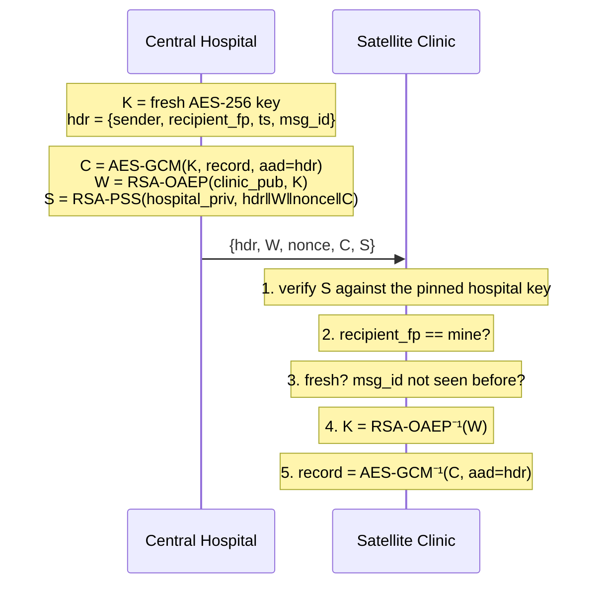

# SecureLink

**Authenticated hybrid encryption and MITM-resistant key exchange in about 500 lines of Python, with an attacker built in.**


SecureLink models two healthcare sites, a central hospital and a satellite clinic, exchanging patient records over an untrusted network. An attacker, Mallory, tries to read, alter, forge, replay and intercept that traffic. Each defence in the code exists because an attack on it is demonstrated and tested.

```
$ securelink demo

== 3. Attacks on the envelope ==
  [blocked] bit-flip in ciphertext: BadSignature
  [blocked] mallory impersonates hospital: BadSignature
  [blocked] replay of captured envelope: Replayed
  [blocked] one-hour-old envelope: Expired
  [blocked] mallory opens envelope meant for clinic: WrongRecipient

== 5. Key exchange: X25519 with and without authentication ==
  [MITM] hospital key 54ecf1108334... == mallory's; clinic key 852bc5a0e43d... == mallory's.
  [blocked] mallory's substituted key: HandshakeError: hello claiming to be 'satellite-clinic' is not authentic
  [ok] authenticated X25519: genuine peers agree on 5a088a80b8cd9178..., forward secret
```

Full output: [`docs/demo_output.txt`](docs/demo_output.txt)

---

## What's inside

| Module | What it does | Primitives |
|---|---|---|
| [`keys.py`](securelink/keys.py) | Identity keys, encrypted storage (mode 600), passphrase policy, SHA-256 fingerprint pinning | RSA-3072, PKCS#8 + passphrase encryption |
| [`primitives.py`](securelink/primitives.py) | Safe RSA wrappers that cannot be used with weak padding | RSA-OAEP-SHA256, RSA-PSS-SHA256 |
| [`envelope.py`](securelink/envelope.py) | Sign + encrypt any size of payload for one recipient, with replay and freshness checks | AES-256-GCM, RSA-OAEP key wrap, RSA-PSS |
| [`kex.py`](securelink/kex.py) | Ephemeral key agreement, with an unauthenticated mode (to show MITM) and an authenticated one | X25519, HKDF-SHA256, RSA-PSS |
| [`cli.py`](securelink/cli.py) | `keygen`, `fingerprint`, `seal`, `open`, `demo` | |
| [`tests/`](tests) | 32 tests: round-trips and one per attack | pytest, CI on Linux/macOS/Windows |

## The envelope protocol



**Design decisions**

- **Hybrid, not pure RSA.** RSA-3072 with OAEP can encrypt at most 318 bytes per operation. In the demo, a 512 KB file takes 1,649 RSA operations and about 3 seconds to decrypt, against under a millisecond with AES-256-GCM. So RSA only wraps a 32-byte key.
- **Sign the whole envelope, not just the plaintext.** AES-GCM alone proves integrity but not *origin*: anyone who has the clinic's public key can produce a valid GCM ciphertext. The RSA-PSS signature covers the header, the wrapped key and the ciphertext, so Mallory can't strip it and re-sign under her own name.
- **Verify before decrypting.** The private-key operation only runs on envelopes that are already authenticated, so the recipient never acts as a decryption oracle for strangers.
- **Header as AAD.** The sender, recipient, timestamp and message ID are bound to the ciphertext twice, by GCM and by the signature.
- **Replay protection.** A random 128-bit `msg_id`, a 5-minute freshness window and a replay cache stop a captured "administer 10 mg" order from being sent again.
- **No algorithm negotiation.** The receiver rejects any `alg` value other than the single one it supports, so there is nothing to downgrade.

## Key exchange and the MITM problem

Plain Diffie-Hellman gives you *a* shared secret, but not with *whom*. `kex.py` runs the attack: Mallory swaps both ephemeral keys and ends up holding one session key with each side.

The fix: each side signs `("securelink-hello-v1", my_name, peer_name, my_ephemeral)` with its long-term RSA key. Mallory can substitute the ephemeral key but cannot produce the signature. Binding the peer's name also stops a signed hello from being relayed to a third party. Session keys come from X25519 + HKDF and are discarded afterwards, which gives **forward secrecy**, something the RSA-wrapped envelope cannot offer.

## Threat model

| Attacker can… | Defence | Test |
|---|---|---|
| Read traffic | AES-256-GCM, RSA-OAEP | `test_envelope_roundtrip`, `test_wrong_recipient_rejected` |
| Change a value in transit | GCM tag + RSA-PSS signature | `test_tampered_fields_rejected`, `test_tampered_header_rejected` |
| Pretend to be another site | Pinned sender key, signature | `test_forged_sender_rejected` |
| Resend a captured message | `msg_id` + replay cache | `test_replay_rejected` |
| Hold a message and send it later | timestamp window | `test_stale_or_future_rejected` |
| Force weaker crypto | single fixed algorithm | `test_downgrade_rejected` |
| Swap keys during DH | signed ephemeral keys | `test_authenticated_kex_blocks_mitm` |
| Swap a public key during distribution | out-of-band fingerprint pinning (`--pin`) | `test_fingerprint_pinning` |
| Steal the private key file | passphrase-encrypted PKCS#8, 600 permissions, passphrase policy | `test_save_and_load_roundtrip` |

**Out of scope:** compromised endpoints, side-channel attacks on the host, key revocation and rotation (this would need a PKI/CA or a transparency log), and a distributed replay cache. The envelope also has no forward secrecy, because a stolen RSA key decrypts old envelopes; for live sessions, use the authenticated X25519 handshake.

## Quick start

```bash
git clone https://github.com/Gursimran555/securelink.git
cd securelink
pip install -e ".[dev]"

securelink demo        # attack/defence walkthrough
pytest -v              # 32 tests
```

### Using the CLI

```bash
export SECURELINK_PASSPHRASE='Use-A-Long-Passphrase-42!'   # or leave unset to be prompted

securelink keygen central-hospital
securelink keygen satellite-clinic
securelink fingerprint keys/central-hospital.pub            # compare this over the phone

echo '{"patient":"MRN-000417","HbA1c":6.5}' > record.json
securelink seal record.json --from central-hospital --to keys/satellite-clinic.pub > msg.json
securelink open msg.json --as satellite-clinic --sender keys/central-hospital.pub
```

Edit one character in `msg.json` and `open` prints `REJECTED (BadSignature)`.

## Disclaimer

SecureLink is an educational reference implementation. It is built on the audited [`cryptography`](https://cryptography.io) library and never implements a primitive itself. It has not had an independent review, so in production, use TLS 1.3, Signal-style protocols, or [age](https://age-encryption.org)/[HPKE (RFC 9180)](https://www.rfc-editor.org/rfc/rfc9180) rather than a custom protocol.

## License

MIT
